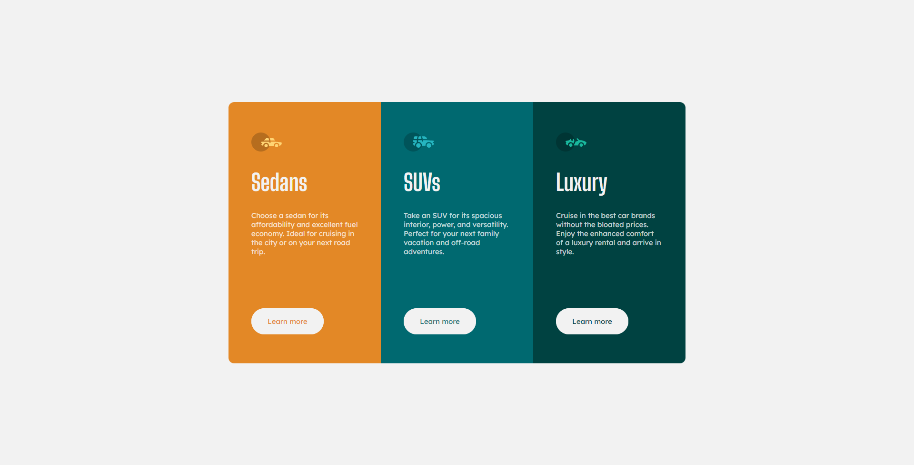
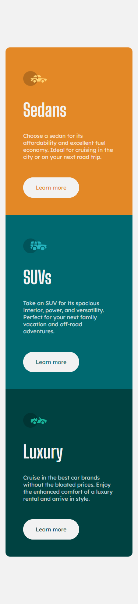

# Frontend Mentor - 3-column preview card component solution

This is a solution to the [3-column preview card component challenge on Frontend Mentor](https://www.frontendmentor.io/challenges/3column-preview-card-component-pH92eAR2-). Frontend Mentor challenges help you improve your coding skills by building realistic projects. 

## Table of contents

- [Overview](#overview)
  - [The challenge](#the-challenge)
  - [Screenshot](#screenshot)
  - [Links](#links)
- [My process](#my-process)
  - [Built with](#built-with)
  - [What I learned](#what-i-learned)
- [Author](#author)

## Overview

### The challenge

Users should be able to:

- View the optimal layout depending on their device's screen size
- See hover and focus states for interactive elements

### Screenshot

### Links

- Solution URL: [Site-Fm](https://www.frontendmentor.io/solutions/responsive-card-3-column-component-using-flexbox-S6lKJY_PLX)
- Live Site URL: [Site-Url](https://3columnfmchallenge.netlify.app/)

## My process

### Built with

- HTML5
- CSS custom properties
- Flexbox
- Mobile-first workflow

### What I learned

I learned a bit more of mobile first design and the flex property. The responsive design is hard for me, but i will improve that.

## Author

- Frontend Mentor - [@Alenayc-Git](https://www.frontendmentor.io/profile/Alenayc-Git)
